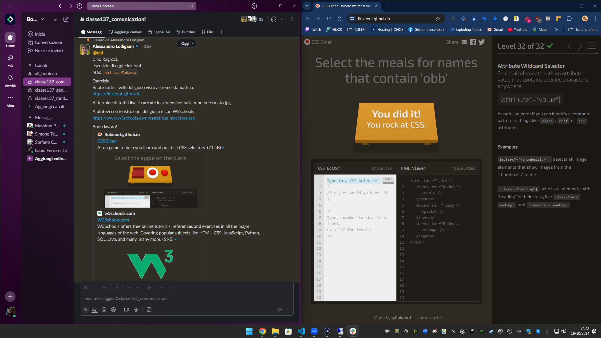

Quinto Esercizio Classe #137 - Boolean
===
Studente: Fabio Ferrero

---
# English

## Target of the project:
Complete the minigame at link: https://flukeout.github.io/

---
# Italiano

## Obiettivo del progetto:
Completare il minigame al link: https://flukeout.github.io/

---

---

---
<strong>Lo screenshot del completamento è il seguente:</strong>

